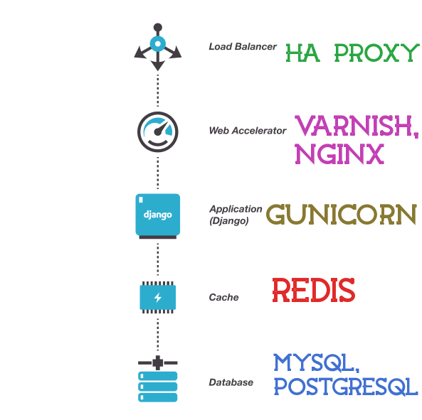

### PyDelhi 2016 Talk Proposal

# Scaling Django To The Sky

This talk is mainly aimed to explain the various stacks for giving maximum output from Django web framework. In this session there will be discussion

* Load balancers
* Web accelarators
* Application servers
* Caching systems
* Databases

### Architecture hack

### Solutions for these problems will be discussed in the session

<b>How to organize these software pieces as a perfect architecture to draw maximum performance to scale millions of requests a day?</b>

<b>How we can do that with a simple and elegant stack</b>

I had good amount of Django Development experience. You can find my other observations of Django in my blogs.

<a href="http://django-planet.com/authors/388/naren-arya/" target="_blank"> Naren Arya on Django Planet</a>

